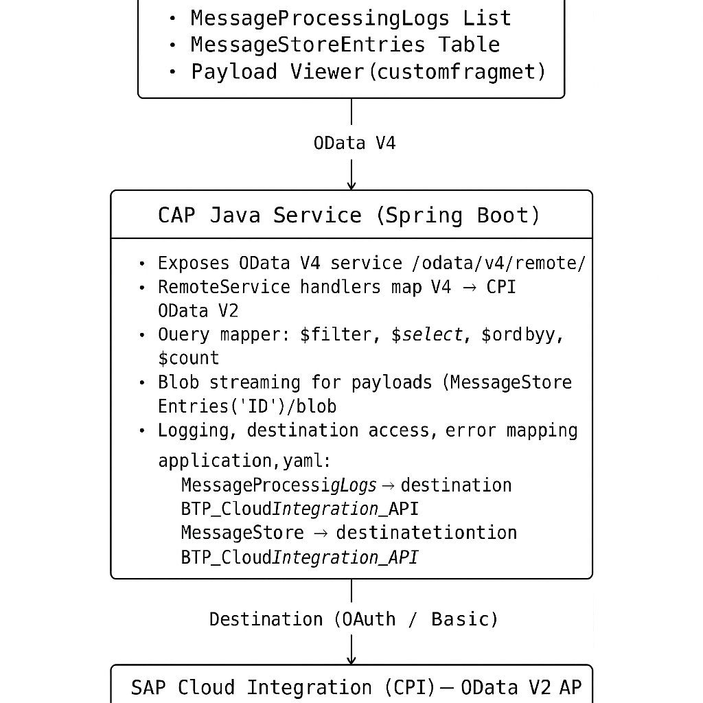

# CPI Message Viewer (SAP BTP + SAP Cloud Integration)

SAP Cloud Integration provides a message store for persisted payloads, but—according to SAP’s documentation—there is **no user interface-based option** to view Message Store Entries. Access is only possible via the OData API.

**CPI Message Viewer** fills this gap.

This application offers a user-friendly way to inspect:

- **Message Processing Logs**
- **Message Store Entries** (Payloads)
- **Custom Header Properties**
- **Custom Status values**

It is especially useful for **functional consultants** and **support teams** who need to check payloads during project implementation but normally don’t have access to Integration Suite tooling.

The backend uses **CAP Java** to expose SAP CPI’s OData V2 APIs as **OData V4**, which powers the modern **Fiori Elements** UI.

---

## 🚀 Architecture

Below is the architecture diagram embedded directly from the project:



---

## ✨ Features

- Modern **Fiori Elements UI** (List Report, Object Page, FCL)
- Search by **Custom Status** and **Custom Header Properties**
- View **Message Processing Logs** including custom header properties
- View **Message Store Entries** including payloads (JSON, XML, Text)
- CAP Java backend with **OData V4 → OData V2** proxy
- Large payload support via CPI MessageStore streaming
- Works with **SAP Work Zone**, **Launchpad**, or standalone **AppRouter**

---

## 📁 Repository Structure

```
cpi-message-viewer/
│
├── app/
│   └── message-viewer/                        # Fiori Elements UI
│
├── srv/
│   ├── src/main/java                          # CAP Java handlers
│   ├── src/main/resources/application.yaml    # Backend configuration
│   └── ...
│
├── architecture.png                           # Architecture diagram
├── mta.yaml                                   # Deployment descriptor
└── README.md
```

---

# 🔧 Prerequisites

- Node.js ≥ 18
- Java 21
- Maven
- SAP BTP Cloud Foundry environment
- SAP Cloud Integration OData API enabled

> **Note:**  
> In production, the destination is created automatically via the MTA resources.  
> A destination is needed **only for local development**.

---

# 🏃 Running Locally

### 1. Clone repository

```bash
git clone https://github.com/binlah/cpi-message-viewer.git
cd cpi-message-viewer
```

### 2. Install UI dependencies

```bash
cd app/message-viewer
npm install
```

### 3. Local destination (required only for local testing)

Create `./default-env.json`:

```json
{
    "VCAP_SERVICES": {
        "destination": [
            {
                "label": "destination",
                "name": "destination-service",
                "tags": [
                    "destination"
                ],
                "credentials": {
					        ### copy from destination instance / api service key ###
                }
            }
        ],
        "xsuaa": [
            {
                "label": "xsuaa",
                "name": "xsuaa-service",
                "tags": [
                    "xsuaa"
                ],
                "credentials": {
					        ### copy from xsuaa instance ###
                }
            }
        ]
    }
}
```

### 4. Start CAP Java backend

```bash
cd srv
mvn spring-boot:run
```

### 5. Start Fiori UI

```bash
cd app/message-viewer
npm start
```

---

# 🌐 Deployment on SAP BTP

## 1. Prepare parameter extension file

Create `mta-param.mtaext`:

```yaml
_schema-version: 3.3.0
ID: cpi-message-viewer.ext
extends: cpi-message-viewer

parameters:
  subdomain: { { subdomain } }

resources:
  - name: cpi-message-viewer-destination
    parameters:
      btp-api-url: '{{url-from-service-key-plan-api}}'
      btp-api-client-id: '{{clientid-from-service-key-plan-api}}'
      btp-api-client-secret: '{{clientsecret-from-service-key-plan-api}}'
      btp-api-token-url: '{{tokenurl-from-service-key-plan-api}}'
```

## 2. Deploy using extension file

```bash
cf deploy mta_archives/cpi-message-viewer_1.0.0-SNAPSHOT.mtar -e mta-param.mtaext
```

---

# 🙏 Acknowledgments

This project was inspired by **WHINT’s MessageStore Viewer**:  
https://github.com/whint/messagestore-viewer-cf

This application is a fully independent implementation using CAP Java and Fiori Elements.  
No code from WHINT has been reused.

---

# 📄 License

MIT License — see `LICENSE` file for details.
