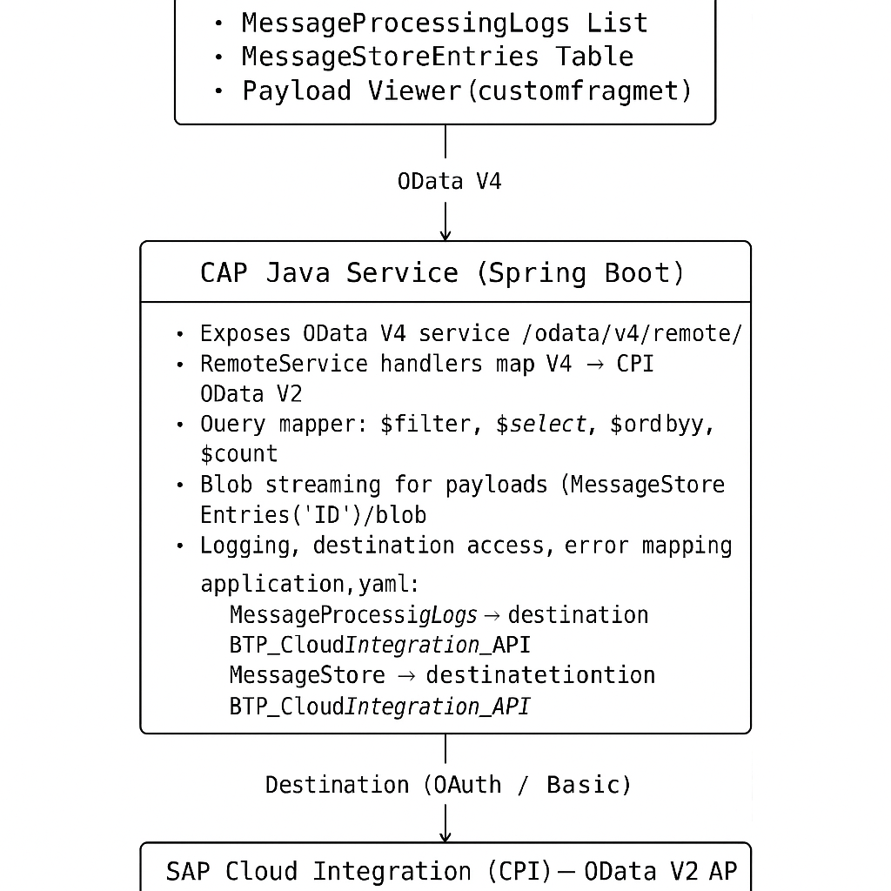

# CPI Message Viewer (SAP BTP + SAP Cloud Integration)
📘 **SAP Community Blog**  
Learn the background, motivation, and design decisions behind this project:  
👉 https://community.sap.com/t5/technology-blog-posts-by-members/exploring-cpi-message-store-amp-mpl-made-easy-introducing-my-open-source/ba-p/14280562

---
SAP Cloud Integration provides a message store for persisted payloads, but—according to SAP’s documentation—there is **no user interface-based option** to view Message Store Entries. Access is only possible via the OData API.

**CPI Message Viewer** fills this gap.

This application offers a user-friendly way to inspect:

- **Message Processing Logs**
- **Message Store Entries** (Payloads)
- **Custom Header Properties**
- **Custom Status values**

It is especially useful for **functional consultants** and **support teams** who need to check payloads during project implementation but normally don’t have access to Integration Suite tooling.

The backend uses **CAP Java** to expose SAP CPI’s OData V2 APIs as **OData V4**, which powers the modern **Fiori Elements** UI.

---

## 🚀 Architecture

Below is the architecture diagram embedded directly from the project:



---

## ✨ Features

- Modern **Fiori Elements UI** (List Report, Object Page, FCL)
- Search by **Custom Status** and **Custom Header Properties**
- View **Message Processing Logs** including custom header properties
- View **Message Store Entries** including payloads (JSON, XML, Text)
- CAP Java backend with **OData V4 → OData V2** proxy
- Large payload support via CPI MessageStore streaming
- Works with **SAP Work Zone**, **Launchpad**, or standalone **AppRouter**

---

## 📁 Repository Structure

```
cpi-message-viewer/
│
├── app/
│   └── message-viewer/                        # Fiori Elements UI
│
├── srv/
│   ├── src/main/java                          # CAP Java handlers
│   ├── src/main/resources/application.yaml    # Backend configuration
│   └── ...
│
├── architecture.png                           # Architecture diagram
├── mta.yaml                                   # Deployment descriptor
└── README.md
```

---

# 🔧 Prerequisites

- Node.js ≥ 18
- Java 21
- Maven
- SAP BTP Cloud Foundry environment
- SAP Cloud Integration OData API enabled

> **Note:**  
> In production, the destination is created automatically via the MTA resources.  
> A destination is needed **only for local development**.

---

# 🏃 Running Locally

### 1. Clone repository

```bash
git clone https://github.com/binlah/cpi-message-viewer.git
cd cpi-message-viewer
mvn clean install
```

### 2. Create service instances and destination on BTP subaccount. (required only for local testing)

Create service instance for destination

| Field | Value |
|-------|-------|
| Service | Destination Service |
| Plan | lite |
| Name | cpi-message-viewer-destination |
| Service Key | app-key (create after instance is created) |

Create service instance for Cloud Integration API ( or you can using existing instance if you've already created it. )

| Field | Value |
|-------|-------|
| Service | SAP Process Integration Runtime |
| Plan | api |
| Name | it-rt_api |
| Service Key | app-key (create after instance is created) |
| Roles | MonitoringDataRead, MessagePayloadsRead, WorkspacePackagesRead |

Create destination for Cloud Integration API

| Field | Value |
|-------|-------|
| Name | BTP_CloudIntegration_API |
| Authentication | OAuth2ClientCredentials |
| Client ID | {{it-rt_api.app-key.clientid}} |
| Client Secret | {{it-rt_api.app-key.clientsecret}} |
| URL | {{it-rt_api.app-key.url}}/api/v1 |
| Token Service URL | {{it-rt_api.app-key.tokenurl}}?grant_type=client_credentials |
| HTML5.DynamicDestination | true |


### 3. Set local environment for testing

Create `./default-env.json`:

```json
{
    "VCAP_SERVICES": {
        "destination": [
            {
                "label": "destination",
                "name": "destination-service",
                "tags": [
                    "destination"
                ],
                "credentials": {
					### copy from cpi-message-viewer-destination.app-key ###
                }
            }
        ]
    }
}
```

### 4. Start CAP Java backend

Change ./app/message-viewer/webapp/manifest.json to run test on local (don't forget to change it back before deployment)

```json
{
	....
    "dataSources": {
      "mainService": {
        "uri": "/odata/v4/remote/", ## add slash at the beginning of uri
        "type": "OData",
        "settings": {
          "annotations": [],
          "odataVersion": "4.0"
        }
      }
    },
	....
}
```

we're ready!! run this command to start CAP service

```bash
mvn spring-boot:run "-Dspring-boot.run.profiles=local"
```
now, you can test access CAP service + Fiori UI at http://localhost:8080/ with this local credential 

| Field | Value |
|-------|-------|
| user | binla |
| pass | binla |

you can change local credential in application.yaml

# 🏃 Running Hybrid

### 5. Create XSUAA service instance with Role Collection

```bash

cf api {API Endpoint}
cf login --sso
cf create-service xsuaa application cpi-message-viewer-auth -c xs-security.json
cf create-service-key cpi-message-viewer-auth app-key
```

These command will create XSUAA service instance, service key and Roles 'MessageViewer' in subaccount.

now, manually create Role Collection 'cpi-message-viewer' with following information.

Roles 
| Field | Value |
|-------|-------|
| Role Name | MessageViewer |
| Role Template | MessageViewer |
| Application Identifier | cpi-message-viewer!XXXXXX |

Users 
| Field | Value |
|-------|-------|
| ID | your email |
| Identity Provider | Default identity provider |
| E-Mail | your email |


### 6. Set hybrid environment for testing

Edit `./default-env.json`:

```json
{
    "VCAP_SERVICES": {
        "destination": [
            {
                "label": "destination",
                "name": "destination-service",
                "tags": [
                    "destination"
                ],
                "credentials": {
					### copy from cpi-message-viewer-destination.app-key ###
                }
            }
        ],
        "xsuaa": [
            {
                "label": "xsuaa",
                "name": "xsuaa-service",
                "tags": [
                    "xsuaa"
                ],
                "credentials": {
					### copy from cpi-message-viewer-auth.app-key ###
				}
            }
        ]
    }
}
```

Create `./app/router/default-env.json`:

```json
{
  "destinations": [
    {
      "name": "srv-api",
      "url": "http://localhost:8080",
      "forwardAuthToken": true
    }
  ],
  "VCAP_SERVICES": {
    "xsuaa": [
      {
        "label": "xsuaa",
        "name": "xsuaa-service",
        "tags": [
          "xsuaa"
        ],
        "credentials": {
			### copy from cpi-message-viewer-auth.app-key ###
		}
      }
    ]
  }
}
```

run following command in terminal 1

```bash
mvn spring-boot:run "-Dspring-boot.run.profiles=hybrid"
```

run following command in terminal 2

```bash
npm install --prefix app/router # this command should be run only first time.
npm start --prefix app/router
```

now, you can test access CAP Service + Fiori UI at http://localhost:5000/ . it should redirect you to login page then after login, you should able to access CAP service and Fiori UI.

---

# 🌐 Deployment on SAP BTP

## 1. Prepare parameter extension file

Create `mta-param.mtaext`:

```yaml
_schema-version: 3.3.0
ID: cpi-message-viewer.ext
extends: cpi-message-viewer

parameters:
  subdomain: {{subdomain}}

resources:
  - name: cpi-message-viewer-destination
    parameters:
      btp-api-url: '{{it-rt_api.app-key.url}}'
      btp-api-client-id: '{{it-rt_api.app-key.clientid}}'
      btp-api-client-secret: '{{it-rt_api.app-key.clientsecret}}'
      btp-api-token-url: '{{it-rt_api.app-key.tokenurl}}'
```

## 2. Deploy using extension file

```bash
cf deploy mta_archives/cpi-message-viewer_1.0.0-SNAPSHOT.mtar -e mta-param.mtaext
```

---

# 🙏 Acknowledgments

This project was inspired by **WHINT’s MessageStore Viewer**:  
https://github.com/whint/messagestore-viewer-cf

This application is a fully independent implementation using CAP Java and Fiori Elements.  
No code from WHINT has been reused.

---

# 📄 License

MIT License — see `LICENSE` file for details.
